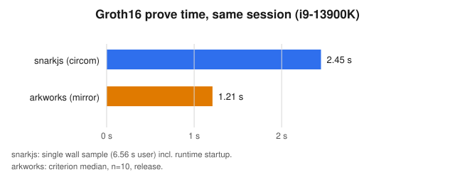
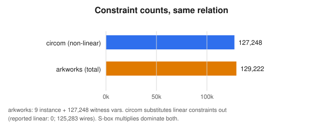
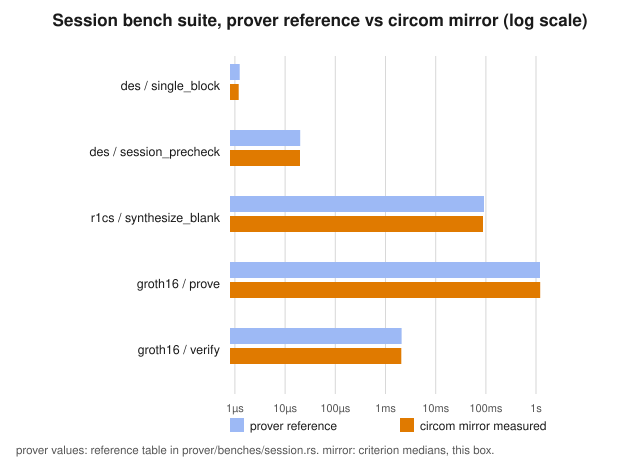

# FeliCa DES Oracle: A Circom-Compatible Second Prover — Technical Report

- Version: 1.0. Date: 2026-09-25 (JST). Status: Final (test-only keys).
- Scope: `circom-prover/` (crate `felica-circom-prover`) against `prover/`
  (crate `felica-prover`); the circuit under test is spec `docs/spec.md` v2 §7.
- Every number below was measured in this repo; §8 tells you how to rerun
  each one. Nothing in `build/` is checked in.

## Abstract

The oracle's zero-knowledge backend used to exist in exactly one form: a
hand-written arkworks R1CS that only a Rust programmer with that codebase
loaded in their head could audit, and that no other toolchain could touch.
This report describes the second backend we built next to it,
`felica-circom-prover`. It says the same thing two ways. The readable way
is a pair of circom sources that compile with stock `circom` 2.x and prove
with stock `snarkjs`. The fast way is a Rust R1CS organized template by
template after those sources, proved with `ark-groth16`, needing no Node
in `cargo test`. The two crates share one API, one test suite, one bench,
and one set of session vectors, so neither side can drift without the
other one screaming. Measured on a single i9-13900K, the circom R1CS
carries 127,248 non-linear constraints against the mirror's 129,222; a
full snarkjs prove takes 2.45 seconds wall against 1.21 for arkworks; all
eight public inputs come out decimal-for-decimal identical; and a tampered
session dies at the MAC assertion in both stacks. Keys on both sides are
throwaway test keys. Production wants a real ceremony, and §6 is blunt
about what these proofs do and do not buy you.

## Contents

1. Why a second backend
2. What the circuit actually proves
3. How the circom backend is built
4. How the two backends are kept honest
5. What we ran and what it showed
6. Head-to-head numbers and what they mean
7. Security, plainly stated
8. Reproducing everything
9. What comes next
10. References

## 1. Why a second backend

The arkworks prover is fast and it is correct, and it is also, frankly,
unreadable to anyone who did not write it. Its DES lives as Rust closures
over boolean gadgets, its S-boxes as interpolation polynomials with
coefficients that look like line noise, and its bit orderings as index
arithmetic you have to take on faith. That was fine while one person held
the whole design in their head. It stops being fine the moment an auditor,
a wallet team, or a Move contract author needs to answer the question
"what does this proof check?" without learning our R1CS vocabulary first.

Circom is not a better proving system. It is a worse one in most ways
that matter for speed. What it is, is the closest thing this ecosystem
has to a common language. A circom source compiles with one public
compiler, proves with `snarkjs`, verifies in Solidity with generated
contracts, and reads — with some patience — as the circuit itself rather
than as code that builds the circuit. So the goal was never to replace
the arkworks backend. The goal was to say the same relation in the common
language, keep the fast backend for production proving, and nail the two
together so hard that they cannot disagree.

Four requirements fell out of that. First, the circom has to be real:
compilable, provable, verifiable end to end, not a sketch. Second, the
Rust API must match the existing crate item for item, so tests, benches,
and the server call-site move over untouched. Third, both sides run the
same vectors on the same stage — same sessions, same benches, same public
inputs — so any divergence is a loud failure, not a quiet one. Fourth,
`cargo test` must not need Node; the snarkjs path stays in scripts for
toolchain-compatibility checks. Deliberately out of scope: production
keys, verifier-contract embedding, and anything beyond single-block reads,
which the spec itself excludes.

## 2. What the circuit actually proves

A session starts with the holder's fresh challenge R1 and ends, after two
card round-trips, with an AUTH2 ciphertext and — when a read was
requested — one encrypted read response. The oracle never sees decrypted
data. At attestation time it checks the exchange, publishes the card's
challenge R2 as the session key, and proves it did all of this with keys
derived from the master hierarchy. The proof carries eight public field
elements and nothing else secret leaks through them.

Concretely the circuit enforces six relations in zero knowledge, with the
seventh holding by construction. The two 3DES checks tie the holder's R1
and the card's R2 to the observed challenges C1B and C2A under the
per-card intermediate keys L and β. The CBC check decrypts the 32-byte
AUTH2 blob under R2 with a zero IV. The MAC check recomputes the 8-byte
command MAC with opcode `0x13` over the first 24 plaintext bytes and
demands equality with the trailing 8. The TID check demands the
plaintext's transaction identifier equal the last six bytes of R1, which
is what binds this proof to this holder's fresh randomness. The IDi check
pulls the card identifier out of the plaintext and exposes it. And the
commitment check is the odd one: there is no hash inside the circuit at
all. The commitment value enters as a public input and leaves as the same
public input, so anybody who tampers with it breaks the Groth16 pairing
equation. The binding is mathematical, not computational, and it costs
zero constraints.

The public inputs are packed to fit the eight-element ceiling that chains
like Sui impose. Three 8-byte values go in as small integers, the 32-byte
AUTH2 ciphertext goes in as two 128-bit halves, IDi and R2 share one
128-bit limb, and the commitment rides as the canonical field element it
already is. Every limb is far below the field modulus, so the packing is
injective and there is no wrap-around ambiguity to argue about.

## 3. How the circom backend is built

The crate has two faces. The readable face is `circuits/des.circom`
(about fifty kilobytes, most of it S-box constants) and
`circuits/felica.circom` (the session logic, a few hundred lines). The
fast face is `src/circuit.rs`, an R1CS that mirrors those templates one
for one and proves with `ark-groth16`. The native DES tables
(`src/des.rs`) and the Poseidon commitment (`src/commit.rs`) are verbatim
copies of the prover crate — one source of truth, no reimplementation,
nothing to drift.

A few decisions shaped the whole thing, and each one deserves its
rationale rather than just its outcome.

S-boxes go through interpolation polynomials, not lookup tables. A
64-entry mux in circom costs on the order of two hundred constraints per
S-box once you count the equality checks and the multiplexing; the
degree-63 polynomial costs sixty-three multiplies plus the bit bindings.
The circuit performs 1,664 S-box evaluations per session — thirteen DES
operations times eight boxes times sixteen rounds — so the lookup
encoding would have landed near four hundred thousand constraints and
pushed proving into the minutes. The polynomial encoding lands at
roughly a hundred and five thousand for the boxes, plus about seventeen
thousand bit-XORs and a few thousand packing constraints, for the totals
§6 reports. The price is readability: the coefficients are opaque field
elements. We pay that price back with the readable `(row, col)` tables
sitting next to them in the same template and a machine check (§4) that
refuses to let the two disagree.

Bit ordering is where DES circuits go to die, so both sides share one
written-down convention and the circom header repeats it: bytes are
field elements pinned to eight bits, LE bits run LSB-first inside each
byte, and DES order flips each byte MSB-first, which is FIPS 46-3 with
bit one as the MSB of byte zero. Every permutation table is a zero-based
copy of the Rust table, and the consistency test diffs them
element-wise. There is no cleverness here on purpose. Cleverness in bit
ordering is how you get a circuit that proves beautifully and checks the
wrong thing.

The commitment stays outside the circuit, exactly as in the arkworks
backend. Putting a Poseidon hash inside would have added thousands of
constraints and a second hash implementation to keep in sync across Rust,
circom, Move, and TypeScript, all to bind a value the pairing equation
already binds for free. The normative commitment definition (BN254,
31-byte LE limbs, rate-2 sponge) lives one layer up, in `commit.rs`, and
is identical in both crates down to the pinned digest.

Writing the circom taught us where the compiler's edges are, and since
anyone touching these files will hit the same edges, they are worth
stating plainly. There are no file-scope variables, so every table lives
inside the template that uses it. Templates do not take array parameters,
so the S-box polynomial is picked by a scalar box index through a
compile-time branch. A component's outputs cannot be read until all of
its inputs are assigned, so wiring goes in one loop per stage, never
interleaved. Output signals need witness hints before they can be pinned,
so the S-box assigns its bits the way `Num2Bits` does and then
constrains them. None of this changes the relation. All of it is the
difference between a file that compiles and one that almost does.

## 4. How the two backends are kept honest

Four mechanisms, layered so that each one catches what the others cannot.

The test suite exists exactly once. The circom crate's
`tests/attest_prove.rs` is three lines: rename this crate to
`felica_prover`, then include the prover's suite file, `mod common` and
all, by path. When the prover side refactored its fixtures into a
`common` module in the middle of this project, the circom side picked it
up with no edits and all thirteen tests passed unmodified. Copy-paste
parity rots; inclusion parity cannot, because there is only one file.

The circom-to-Rust link is machine-checked without needing the circom
binary. `tests/circom_consistency.rs` parses the `.circom` sources and
asserts the permutation tables equal the Rust tables element-wise, the
embedded S-box polynomials equal a from-scratch re-interpolation done
with no private imports, the `main` public list equals
`PUBLIC_INPUT_ORDER` in order, and the hardcoded M0 equals `[34, 0x13,
0×6]` as LE bits. The re-interpolation is deliberately independent
code, so the crate's polys and the test's polys agreeing means the math
agrees, not just the copy-paste.

The polynomial constants regenerate deterministically.
`examples/gen_sbox_poly.rs` re-emits all eight `S_POLY_*` blocks from the
crate's public tables, and its output matches the committed constants
byte-for-byte. If anyone edits a table, the path back to consistent
polys is one command, and the consistency test will fail until they run
it.

The toolchains agree on public inputs, not just on pass/fail.
`scripts/compare_publics.py` diffs the snarkjs `public.json` against the
Rust packing decimal-for-decimal. Eight for eight (see §5). This is the
check that would catch a packing-endianness slip between DSLs, which is
precisely the kind of bug that unit tests on either side alone would
miss.

## 5. What we ran and what it showed

The Rust side first, since it runs with no extra tooling: thirteen
shared session tests (genuine prove, roundtrip with byte-pinned public
limbs, tamper negatives on proof bytes and public inputs, TID/MAC/C1B
rejections, commitment binding, budget pin), four consistency tests, and
seven lib unit tests including the spec DES vector and the pinned
commitment digest. Twenty-four for twenty-four. The blank-circuit count
reads 129,222 constraints, 9 instance variables, 127,248 witness
variables, inside the pinned budget.

The circom side compiles clean under `circom` 2.1.9: twenty template
instances, 127,248 non-linear constraints with the linear ones
substituted out, eight public and eighty-eight private inputs, no public
outputs, 125,283 wires. The small gap to the Rust total is the expected
one — the two systems count boolean linkages and wiring differently,
while the S-box multiplies that dominate both are identical by
construction.

Semantics, not just compilation, got checked. We minted a genuine
session through the card emulator, fed it to the compiled circuit, and
`snarkjs wtns check` reported every one of the 127,248 constraints
satisfied. Then we broke it twice. Flipping an AUTH2 byte while leaving
the publics stale fails at the packing assertion, as it should. Flipping
the byte and repairing the publics to match — the interesting attack —
fails at `FelicaAuth` line 202, the MAC comparison, which is constraint
4 doing its job. A circuit that accepted either forgery would still
"compile" and still "prove" honest sessions; these two negatives are
what make the positives mean something.

Then the full snarkjs ceremony on that same session: local phase-one
(`powersoftau new bn128 18`, `prepare phase2`), `groth16 setup`, one
contribution, verification-key export, prove, verify. Prove took 2.45
seconds wall (6.56 user — the worker threads earn their keep), verify
came back OK, and the publics check agreed on all eight limbs. All keys
involved are throwaway test keys with fixed ceremony metadata recorded
in `scripts/head_to_head.sh`; they prove the pipeline, nothing more.

## 6. Head-to-head numbers and what they mean

Same session, same machine (i9-13900K), both backends at their best
available configuration — snarkjs 0.7.6 single prove versus the Rust
mirror under criterion in release.

| | Circom frontend (snarkjs) | Rust mirror (ark-groth16) |
| Constraints | 127,248 non-linear | 129,222 total (9 instance, 127,248 witness) |
| Prove | 2.45 s wall (6.56 s user) | ~1.21 s median over 10 |
| Verify | OK (~0.9 s wall, mostly Node startup) | ~2.07 ms |
| Proof size | 806 bytes of JSON | ~1 KB of hex JSON |
| Public inputs | matches Rust packing 8-for-8 | reference |

A few honest caveats before anyone cites these. The snarkjs prove time
is one wall sample including runtime startup, while the arkworks number
is a criterion median; the gap is real but the methodology favors Rust
slightly. The verify comparison is almost meaningless — a Groth16
verifier does three pairings plus work linear in the eight publics
either way, and the snarkjs figure is dominated by spinning up Node.
What actually matters in the table is the constraint counts landing
within two percent of each other and the publics agreeing exactly: the
frontends describe the same relation at the same scale, and the Rust
mirror keeps the proving speed the arkworks backend was built for.





The bench suite tells the same story at finer grain. Every group below
pairs the prover crate's documented reference against the mirror's
measured criterion median on this box, and every pair overlaps —
unsurprising for the native groups, which are literally the same code,
and confirming for the proving groups, where the R1CS has the same
shape.

| Bench group | Prover reference | Mirror measured |
| Single DES block | ~1.25 µs | ~1.19 µs (1.179–1.204) |
| Session precheck (native) | ~20 µs | ~19.8 µs (19.53–20.09) |
| Blank synthesis | ~92 ms | ~88 ms (85.3–90.0) |
| Groth16 prove | ~1.2 s | ~1.21 s (1.174–1.261) |
| Groth16 verify | ~2.1 ms | ~2.07 ms (2.048–2.100) |



## 7. Security, plainly stated

Start with what these proofs do not do, because that list is doing most
of the work. They do not get fresh keys — both backends mint their own
parameters from OS randomness or a local one-shot ceremony, and shipping
either to production without a real ceremony would be malpractice. The
verification keys are not interchangeable: same session, same publics,
different proving-system state, so a verifier pins exactly one key and
the README says so where nobody can miss it. And the proofs do not make
an untrusted oracle trustworthy. The oracle holds the key hierarchy, and
anyone holding it can simulate a card, mint a session, and prove anything
they like. The proof certifies that the key holder approved this
commitment — authority binding, in the spec's term — and the
commit-before-R2-release ordering is what stops post-hoc forgery, not
the zero-knowledge machinery. Readers who want the full threat model
should read spec §10; nothing here weakens it and nothing here extends
it.

What the machinery does contribute is precision about the session. The
TID check ties the proof to the holder's fresh randomness, the MAC check
ties it to bytes the card actually produced under R2, and the commitment
alias ties it to ciphertexts registered before R2 went public. Our
negative tests exercise each link: pack-breaks die at packing,
ciphertext forgeries die at the MAC line, cross-session splices die at
TID. The `check_satisfiable` helper exists so future mutation tests can
assert each §7 constraint constrains on its own, distinguishing a
circuit gap (satisfiable anyway) from a native rejection (never reaches
the circuit) — a distinction `prove`-only tests cannot make.

Out of scope, unchanged from the spec: single-block reads only, no AES
v2 cards, all-zero commitment means authentication-only.

## 8. Reproducing everything

The Rust side needs nothing beyond the toolchain:

```sh
cargo test --manifest-path circom-prover/Cargo.toml
cargo bench --manifest-path circom-prover/Cargo.toml --bench session
cargo run --manifest-path circom-prover/Cargo.toml --example constraint_counts
```

The circom side needs `circom` 2.x, Node, and `npx` (snarkjs pins
itself at 0.7.6 inside the scripts):

```sh
sh circom-prover/scripts/compile.sh --wasm
cargo run --manifest-path circom-prover/Cargo.toml \
  --example dump_witness_input > circom-prover/build/input.json
node circom-prover/build/felica_js/generate_witness.js \
  circom-prover/build/felica_js/felica.wasm \
  circom-prover/build/input.json circom-prover/build/witness.wtns
sh circom-prover/scripts/head_to_head.sh
```

The last script runs the local ceremony, setup, contribution, prove,
verify, and the publics diff end to end. Everything it writes lands in
`build/`, which is git-ignored; a fresh clone reproduces every number
in this report. The figures are generated without dependencies by
`python3 docs/figs/gen_figs.py`.

## 9. What comes next

The obvious next step is also the one that must not be rushed: a real
ceremony and the verifier-key embedding into the Move contracts, which
turns these test keys into something a chain can trust. After that, in
rough order of value: proving the compiled R1CS directly from Rust
(`ark-circom` against the checked-in arteries here) so snarkjs stops
being load-bearing for cross-toolchain confidence; per-constraint
mutation tests through `check_satisfiable` now that both backends expose
it; and an external audit whose scope should start at the bit-ordering
conventions and the S-box derivation, because that is where this kind of
circuit hides its worst bugs. Multi-block reads stay out unless the spec
takes them in — the commitment framing and the TN chain both assume one
block, and changing that is a protocol change, not a circuit tweak.

## 10. References

- `docs/spec.md` v2 — the oracle gate specification: key hierarchy and
  challenge schedule (§4.1), AUTH2 and read framing (§4.2–4.4), the
  normative commitment (§4.5), the circuit (§7), the RPC surface and
  error codes (§8), verification policy (§9), and the security model
  (§10–11).
- `soltia48/felica-rs` — card emulation, service-key chain, AUTH2
  framing; the only crypto the oracle trusts natively.
- circom 2.1.9 and snarkjs 0.7.6 — the external proving toolchain.
- arkworks 0.5 (ark-bn254, ark-groth16, ark-r1cs-std) — the Rust proving
  toolchain shared by both backends.
- FIPS 46-3 — DES bit numbering and the S-box tables both backends encode.
